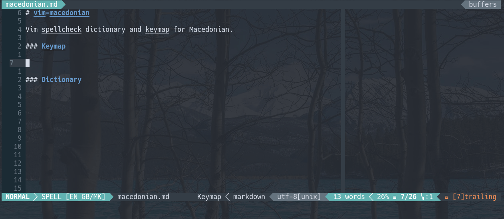

# vim-macedonian

Vim spellcheck dictionary and keymap for Macedonian.



### Keymap

The keymap is based on the usual layout for Macedonian with a few tweaks. To use it place `macedonian_utf-8.vim` in a `keymap` subdirectory in the Vim `runtimepath`, e.g. for NeoVim either `usr/share/nvim/runtime/keymap/` or `~/.config/nvim/keymap/` and add this to your init:

```vim
set keymap=macedonian
```

And maybe remap the layout change:

```vim
lnoremap <c-f> <c-^>
inoremap <c-f> <c-^>
```

### Dictionary

The dictionary is [ported](https://github.com/gerazov/dictionary-mk) from the [Open Office Macedonian dictionary extension](https://extensions.openoffice.org/en/project/macedonian-spellchecker-dictionary) and originally developed by the [Free/Libre Software Organisation of Macedonia (OSSM)](https://www.slobodensoftver.org.mk/).

To enable the spellcheck for Macedonian place `mk.utf-8.spl` in a `spell` subdirectory in your Vim `runtimepath`, e.g. `~/.config/nvim/spell/`. Now you can add this to your init:

```vim
set spelllang=en_gb,mk
```

Alternatively you can specify it for different file types via the `vim-lexical` plugin:

```vim
filetype plugin on
augroup lexical
  autocmd!
  autocmd FileType markdown,mkd call lexical#init()
  autocmd FileType *.gift call lexical#init()
  autocmd FileType latex,tex call lexical#init()
  autocmd FileType textile call lexical#init()
  autocmd FileType text call lexical#init({ 'spell': 1 })
  autocmd FileType text nmap j gj
  autocmd FileType text nmap k gk
  autocmd FileType text nmap $ g$
  autocmd FileType text nmap 0 g0
augroup END
let g:lexical#spelllang = ['en_gb','mk',]
```
